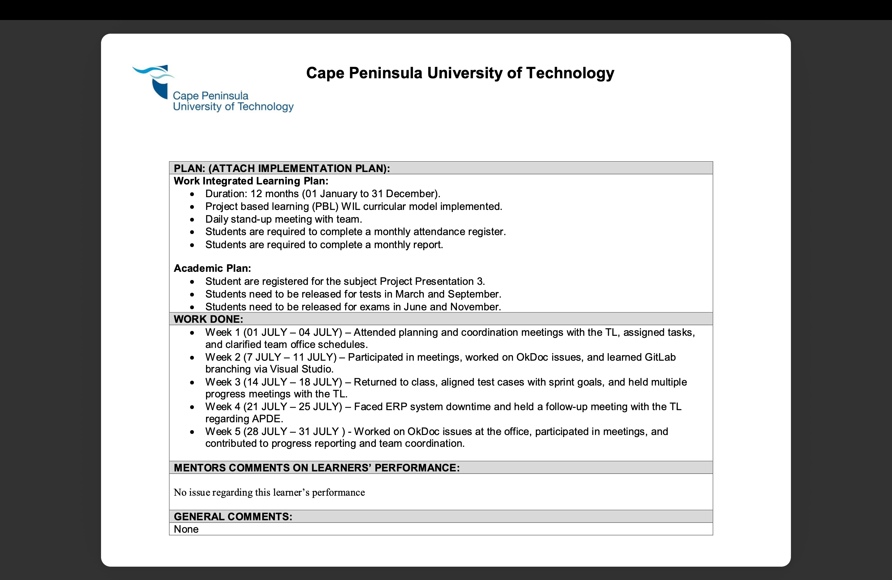
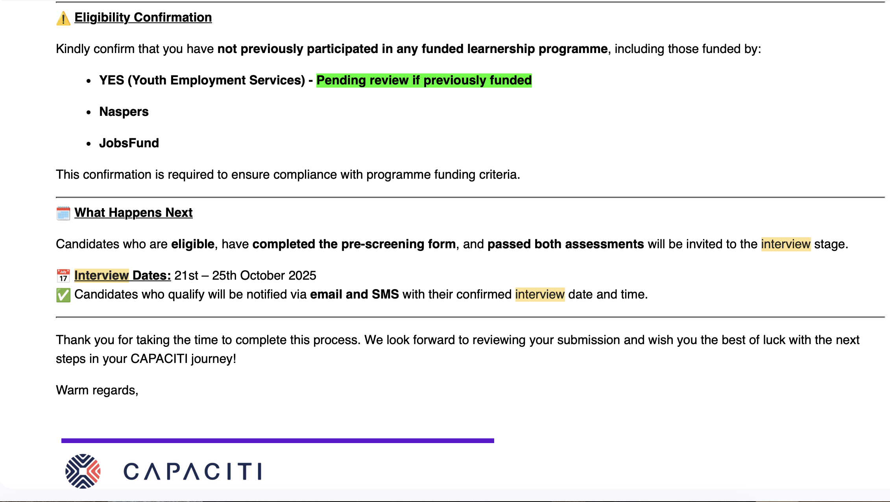
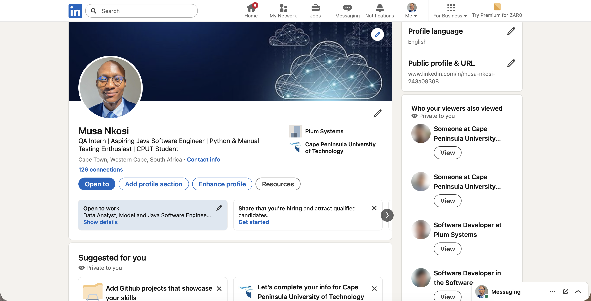
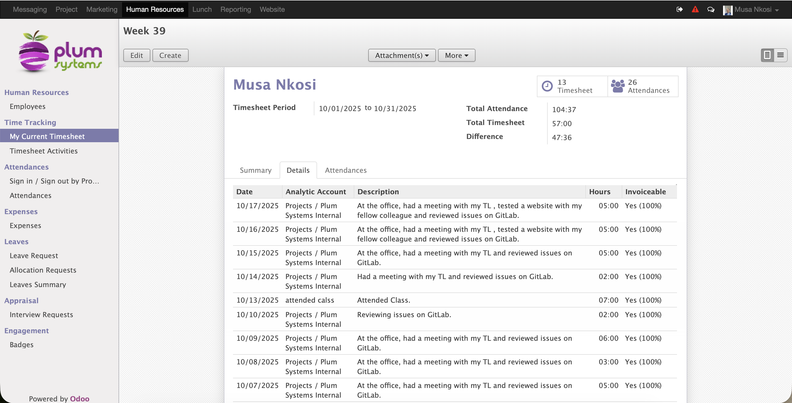

# GITHUB-DIGITAL-PORTFOLIO

## Digital Portfolio – PRP372S (Project Presentation 3)  
**Student Name:** Musa Banathi Nkosi  
**Student Number:** 221744517  
**Course Code:** PRP372S   
**Qualification:** Diploma in Information and Communication Technology  
**Faculty:** Informatics and Design  
**Lecturer:** P. Inderlal  
**Due Date:** 18 October 2025  

## Introduction
This digital portfolio represents my professional and personal growth throughout the Work Readiness Training for PRP372S. It includes evidence and reflections on five critical areas of workplace readiness: Business Communication, Interview Skills, Mock Interview, Professional Networking, and Workplace Etiquette.  
Each section includes artefacts and reflections based on the STAR Technique (Situation, Task, Action, Result) to demonstrate how I developed essential skills for success in the ICT industry.

## (1) Business Communication
  
### Evidence
As part of my QA internship, I was actively involved in daily stand-up meetings, sprint planning discussions, and report presentations. I was responsible for documenting and communicating the outcomes of functional testing to both developers and the project manager. Additionally, I completed a LinkedIn Learning course titled “Developing Effective Business Communication Skills”, which focused on clarity, tone, and professionalism in workplace communication.  
  
  
  
### Reflection (STAR Technique)
**Situation:**
During one of our sprint review meetings, I was assigned to present the results of the testing phase for a newly developed payment feature in our e-commerce application. The project manager emphasized that the presentation should be concise, data-driven, and understandable to non-technical stakeholders. 
  
**Task:**
My task was to summarize testing progress, highlight critical defects, and propose viable solutions in a professional and easy-to-understand manner. This required me to refine my communication style to ensure it was clear, confident, and collaborative.  
  
**Action:**
I began by drafting a short written report that included visual representations of defect trends using screenshots from our Jira board. I rehearsed how I would present my findings, paying attention to tone, pace, and body language. I also sought feedback from my QA team leader to refine my delivery. During the meeting, I communicated each point clearly, emphasized the implications of specific defects, and made constructive suggestions to resolve them.  
  
**Result:**
The project manager commended my report for its clarity and professionalism, and my recommendations were adopted into the development plan. This experience taught me that effective business communication is not just about sharing information, but about doing so in a structured, confident, and solution-oriented way. It strengthened my ability to communicate technical results to diverse audiences while maintaining professional composure.  

## (2) Interview Skills
### Evidence
Before securing my internship, I attended a professional interview skills workshop as part of my PRP372S program. I also engaged in self-practice sessions by recording my responses to common QA interview questions, focusing on both technical and behavioral aspects.  
  
  
  
### Reflection (STAR Technique)
**Situation:**
When I began applying for QA internships, I realized that my technical skills alone would not be enough — I needed to effectively communicate my experience, strengths, and problem-solving abilities. During a mock interview session organized by the program, I was given the opportunity to practice real-world interview scenarios.  
  
**Task:**
My goal was to improve how I articulated my thoughts during interviews, especially when describing projects, teamwork experiences, and problem-solving strategies. I aimed to use structured and concise responses that left a strong impression.  
  
**Action:**
I prepared by researching the company and reviewing common STAR-based questions. I practiced responses such as “Describe a time you handled a difficult bug” and “How do you manage deadlines under pressure?” I recorded myself answering these questions to analyze tone, clarity, and posture. During the mock interview, I focused on staying calm, maintaining eye contact, and confidently explaining my experience with bug tracking and QA documentation.  
  
**Result:**
The feedback I received was positive — my interviewer highlighted my professional tone and clear technical understanding. When I attended my real internship interview later, I applied the same techniques and successfully secured the position. This experience enhanced not only my confidence but also my self-awareness as a professional communicator.  

## (3) Mock Interview Video
### Evidence
I recorded and submitted a mock interview video as part of my Work Readiness Training. The simulation was structured to replicate a real QA Engineer interview, including both technical and behavioral questions. I reviewed my recording afterward and received constructive feedback from my lecturer.  
  
  
  
### Reflection (STAR Technique)
**Situation:**
For the mock interview assessment, I was required to simulate a QA position interview conducted by a senior team leader. The purpose was to assess my ability to handle formal questioning under pressure.  
  
**Task:**
I needed to demonstrate my readiness for the industry by presenting myself confidently, answering technical questions effectively, and showcasing my knowledge of testing methodologies such as regression, integration, and user acceptance testing.  
  
**Action:**
Before the recording, I prepared a professional environment with proper lighting and background to simulate a real interview. I practiced my introduction and researched questions commonly asked during QA interviews. During the recording, I maintained a professional tone, smiled, and answered clearly, ensuring I gave real examples of challenges I faced in testing and how I overcame them. After submission, I rewatched the recording to analyze my posture, pacing, and level of confidence.  
  
**Result:**
The exercise helped me identify areas for growth — I needed to slow down when answering questions and use more specific examples. The feedback from my lecturer was encouraging, noting improvement in my communication and professionalism. The mock interview experience gave me valuable insight into how I present myself under pressure, preparing me for real-world interview scenarios.  

## (4) Professional Networking
### Evidence
I created and developed my LinkedIn profile to reflect my academic and professional journey. I included details about my internship, LinkedIn Learning certificates, and university projects such as Roommate Roulette and Off Kulture E-commerce System. I connected with my lecturers, colleagues, and several professionals in the IT and QA fields.  
  
  
  
### Reflection (STAR Technique)
**Situation:**
At the start of my internship, I realized that networking was essential to career development. I wanted to establish a professional online presence where I could showcase my skills, interact with industry experts, and stay informed about the latest QA trends.  

**Task:**
My goal was to create a credible and engaging LinkedIn profile that would attract professional connections and potential employers while reflecting my genuine interests and expertise.  
  
**Action:**
I started by updating my LinkedIn headline and summary to reflect my career goals in software testing. I uploaded my certificates, academic projects, and shared insights about my learning experiences. I also joined QA-focused groups and engaged in meaningful discussions with professionals. I made an effort to connect with people who inspired me, including mentors and team leads from my internship.  
  
**Result:**
Over time, my profile gained visibility, and I received several messages from recruiters and industry professionals offering advice. Networking has helped me stay informed about automation testing tools and current industry practices. I have learned that building relationships is just as important as building skills — it opens doors to collaboration, mentorship, and professional growth.  

## (5) Workplace Etiquette
### Evidence
As part of my internship, I adhered to workplace protocols such as punctuality, teamwork, and professional communication. I also completed the Workplace Etiquette module, which focused on ethical behavior, respect, and emotional intelligence in the professional environment.  
  
  
  
### Reflection (STAR Technique)
**Situation:**
During a testing cycle, I encountered a disagreement with a developer regarding a reported defect. The developer believed the issue was caused by user error, while my test results suggested otherwise.  
  
**Task:**
I needed to address the disagreement respectfully, ensuring that my feedback was clear, evidence-based, and professional — without creating tension or misunderstanding within the team.  
  
**Action:**
I scheduled a short meeting with the developer to go through the bug step-by-step. Instead of being defensive, I calmly explained the testing process, shared screenshots, and provided the exact steps to reproduce the error. I maintained a polite tone, listened to their perspective, and focused on problem-solving rather than blame.  
  
**Result:**
The developer appreciated my professional approach, and we identified a minor configuration issue that caused the defect. This experience strengthened our working relationship and improved overall team communication. I learned that professionalism is not just about following rules — it’s about showing empathy, patience, and respect in every interaction. Maintaining workplace etiquette has since become a core part of how I operate in a professional environment.  
